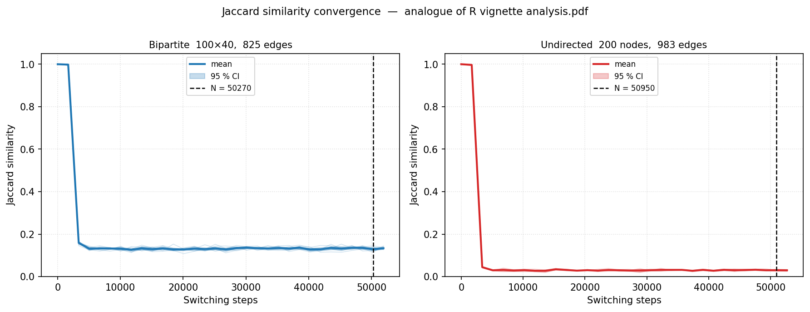
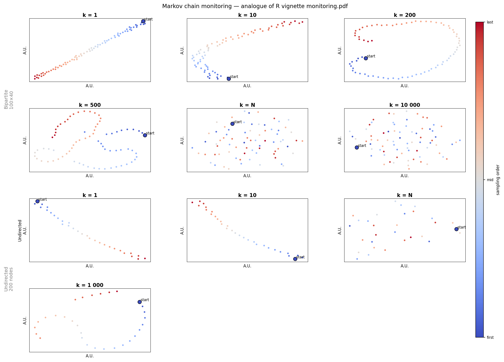

# R vignette reproductions

This page reproduces the two main figures from the BiRewire R package vignette
(`BiRewire.Rnw`, section "Example") using PyBiRewireX.  The source code is in
[`scripts/demo.py`](https://github.com/lorenzoamir/PyBiRewireX/blob/main/scripts/demo.py).

## Networks used

```python
# R vignette: bipartite.random.game(n1=100, n2=40, p=0.2)
rng = np.random.default_rng(42)
bp  = (rng.random((100, 40)) < 0.20).astype(np.int16)

# R vignette: erdos.renyi.game(n=200, p=0.05, directed=F)
_u  = (rng.random((200, 200)) < 0.05).astype(np.int16)
und = np.triu(_u, 1); und = (und + und.T).clip(0, 1).astype(np.int16)
```

## Analysis — analogue of `analysis.pdf`

```python
result = pbr.analysis_bipartite(bp, n_networks=10, max_iter=10*N, step=step)
```



Each thin line is one independent rewiring run. The solid line is the mean; the
shaded band is the 95 % CI. The dashed vertical line marks the analytical bound
N, where the chain is guaranteed to have reached the stationary distribution.

## Monitoring — analogue of `monitoring.pdf`

```python
# sequence matches R: c(1, 10, 200, 500, "n", 10000)
for k in [1, 10, 200, 500, N_bp, 10000]:
    nets = collect_chain(bp, interval=k, n_samples=75)
    D    = pairwise_jaccard_distance(nets)
    emb  = tsne_embed(D, perplexity=10)   # Rtsne-faithful pipeline
```



Each point is a sampled network. Colour encodes sampling order (blue = first,
red = last).  At `k=1` the chain barely moves; at `k=N` and `k=10 000` the
samples are indistinguishable from i.i.d. draws from the null model.

## R vs Python differences

| Aspect | R BiRewire | PyBiRewireX |
|--------|-----------|------------|
| PRNG | Mersenne Twister | xorshift64 |
| Default bound formula | `exact=FALSE` | `exact=False` (identical) |
| `max_iter` semantics | total attempts | total attempts (identical) |
| Rtsne pipeline | normalize → PCA(50) → TSNE(euclidean) | identical |
| Sparse input | igraph only | igraph + networkx + scipy.sparse |
| DSG rewiring | ✓ | not yet implemented |

Individual rewired matrices differ between R and Python because the PRNGs
differ.  All statistical invariants (degree sequences, stationary distribution,
convergence rate) are identical.
